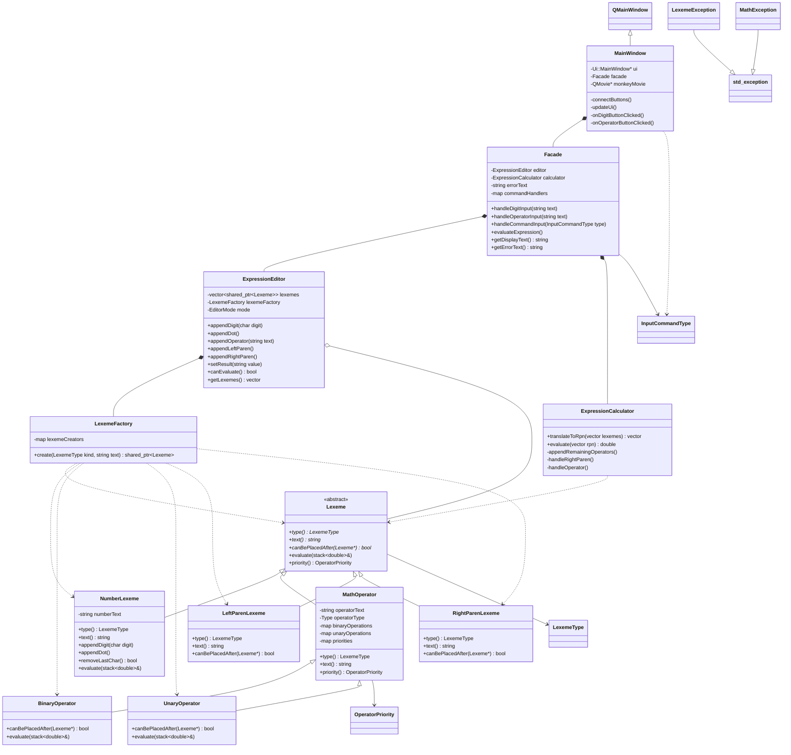

```mermaid
classDiagram
    QMainWindow <|-- MainWindow

    MainWindow *-- Facade
    MainWindow ..> InputCommandType

    Facade *-- ExpressionEditor
    Facade *-- ExpressionCalculator
    Facade --> InputCommandType

    ExpressionEditor *-- LexemeFactory
    ExpressionEditor o-- Lexeme

    ExpressionCalculator ..> Lexeme

    LexemeFactory ..> Lexeme
    LexemeFactory ..> NumberLexeme
    LexemeFactory ..> BinaryOperator
    LexemeFactory ..> UnaryOperator
    LexemeFactory ..> LeftParenLexeme
    LexemeFactory ..> RightParenLexeme

    Lexeme <|-- NumberLexeme
    Lexeme <|-- MathOperator
    Lexeme <|-- LeftParenLexeme
    Lexeme <|-- RightParenLexeme

    MathOperator <|-- BinaryOperator
    MathOperator <|-- UnaryOperator

    Lexeme --> LexemeType
    MathOperator --> OperatorPriority

    LexemeException --|> std_exception
    MathException --|> std_exception

    class MainWindow {
        -Ui::MainWindow* ui
        -Facade facade
        -QMovie* monkeyMovie
        -connectButtons()
        -updateUi()
        -onDigitButtonClicked()
        -onOperatorButtonClicked()
    }

    class Facade {
        -ExpressionEditor editor
        -ExpressionCalculator calculator
        -string errorText
        -map commandHandlers
        +handleDigitInput(string text)
        +handleOperatorInput(string text)
        +handleCommandInput(InputCommandType type)
        +evaluateExpression()
        +getDisplayText() string
        +getErrorText() string
    }

    class ExpressionEditor {
        -vector~shared_ptr~Lexeme~~ lexemes
        -LexemeFactory lexemeFactory
        -EditorMode mode
        +appendDigit(char digit)
        +appendDot()
        +appendOperator(string text)
        +appendLeftParen()
        +appendRightParen()
        +setResult(string value)
        +canEvaluate() bool
        +getLexemes() vector
    }

    class ExpressionCalculator {
        +translateToRpn(vector lexemes) vector
        +evaluate(vector rpn) double
        -appendRemainingOperators()
        -handleRightParen()
        -handleOperator()
    }

    class LexemeFactory {
        -map lexemeCreators
        +create(LexemeType kind, string text) shared_ptr~Lexeme~
    }

    class Lexeme {
        <<abstract>>
        +type()* LexemeType
        +text()* string
        +canBePlacedAfter(Lexeme*)* bool
        +evaluate(stack~double~&)
        +priority() OperatorPriority
    }

    class NumberLexeme {
        -string numberText
        +type() LexemeType
        +text() string
        +appendDigit(char digit)
        +appendDot()
        +removeLastChar() bool
        +evaluate(stack~double~&)
    }

    class MathOperator {
        -string operatorText
        -Type operatorType
        -map binaryOperations
        -map unaryOperations
        -map priorities
        +type() LexemeType
        +text() string
        +priority() OperatorPriority
    }

    class BinaryOperator {
        +canBePlacedAfter(Lexeme*) bool
        +evaluate(stack~double~&)
    }

    class UnaryOperator {
        +canBePlacedAfter(Lexeme*) bool
        +evaluate(stack~double~&)
    }

    class LeftParenLexeme {
        +type() LexemeType
        +text() string
        +canBePlacedAfter(Lexeme*) bool
    }

    class RightParenLexeme {
        +type() LexemeType
        +text() string
        +canBePlacedAfter(Lexeme*) bool
    }
```
